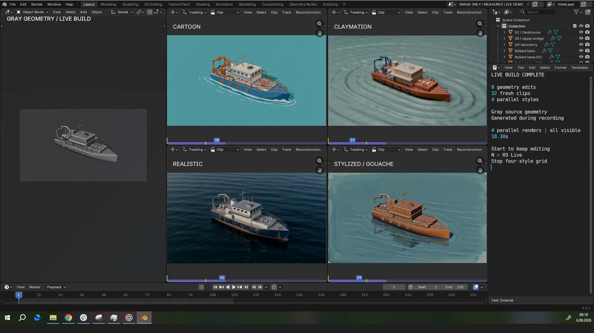

# H3 Max Blender

A neural rendering demo built with **GPT-6 Astra + H3 Max on fal**.

A simple gray ship grows into a detailed vessel in Blender, with **cartoon, claymation, realistic, and painted** video previews updating alongside it.

[](https://github.com/gokayfem/H3-Max-Blender/raw/refs/heads/main/demo/blender-neural-renderer.mp4)

[Watch the video](https://github.com/gokayfem/H3-Max-Blender/raw/refs/heads/main/demo/blender-neural-renderer.mp4)

## Run it

Requires **Blender 5.1.2 on Windows**, Python, FFmpeg on PATH, and a fal API key.

1. [Download the demo extension](https://github.com/gokayfem/H3-Max-Blender/releases/download/demo-v1/fal_ai-0.2.0-windows-x64-py3.13.zip). In Blender, install via **Preferences > Add-ons > Install from Disk** and enable fal.ai.
2. Copy `.env.example` to `.env` and fill in `FAL_KEY`.
3. Run:

```sh
python scripts/run_demo.py --blender "C:/Program Files/Blender Foundation/Blender 5.1/blender.exe" --output outputs/demo-01 --generate
```

This opens a fresh Blender scene and builds the ship automatically. A full run makes **32 paid generation requests**. Use a new output folder for each run.

Experimental: previews update asynchronously and generated details can vary. The recording skips the first wait and loops 1.8-second moving excerpts of five-second outputs.

Demo scripts by GPT-6 Astra; video generation by H3 Max. Uses our [modified fal Blender extension](https://github.com/gokayfem/fal-blender-extension), based on [fal-ai/fal-blender-extension](https://github.com/fal-ai/fal-blender-extension). GPL-3.0-or-later.
